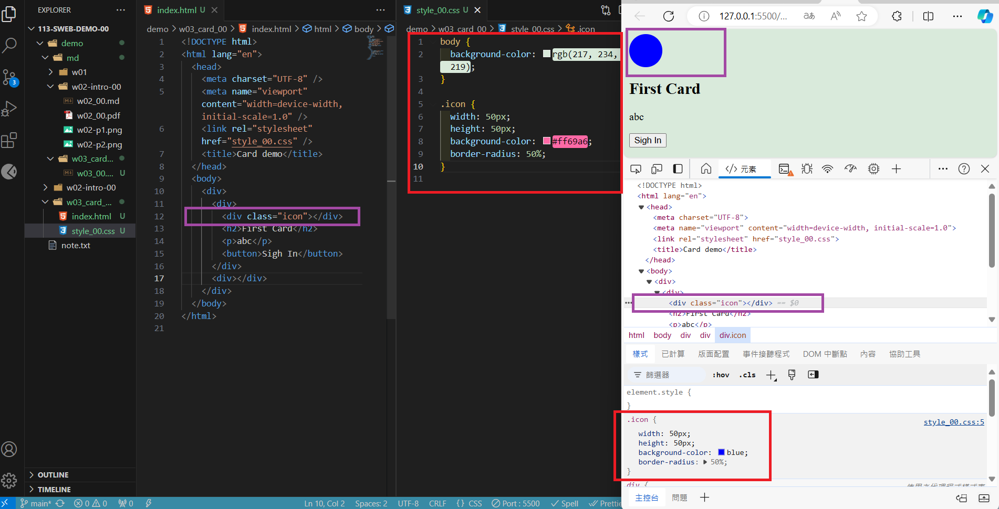
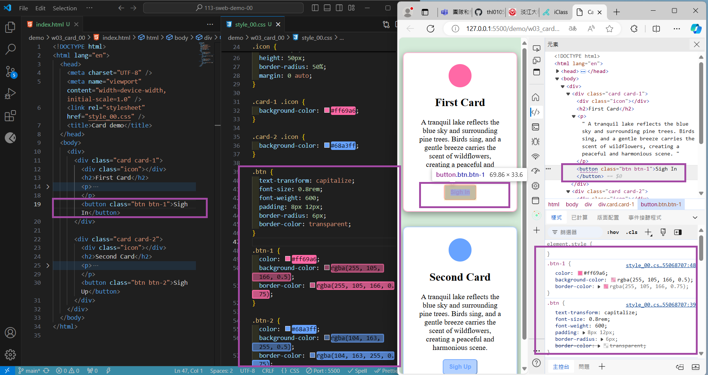

[My Github URL](https://github.com/thl010521/113-sweb-demo-00)

### W03-P1: Show first card and change icon color using DevTools



```
668eacd thl010521       Thu Sep 26 21:28:45 2024 +0800  W03-P1: Show first card and change icon color using DevTools
```

---

### W03-P2: Show btn and btn-1 class selector in DevTools compare to that in HTML and CSS



```
79bfe38 thl010521       Thu Sep 26 21:30:02 2024 +0800  W03-P2: Show btn and btn-1 class selector in DevTools compare to that in HTML and CSS
```

---

### W03-P3: Show 2 photos with the same height, remain photo ration, and show .img class selector


```
d99516f thl010521       Thu Sep 26 21:30:47 2024 +0800  W03-P3: Show 2 photos with the same height, remain photo ration, and show .img class selector
```

---

### W03-P4: git logs of W3

```
$ git log --pretty=format:"%h%x09%an%x09%ad%x09%s" --after="2024-09-25"
d99516f thl010521       Thu Sep 26 21:30:47 2024 +0800  W03-P3: Show 2 photos with the same height, remain photo ration, and show .img class selector
79bfe38 thl010521       Thu Sep 26 21:30:02 2024 +0800  W03-P2: Show btn and btn-1 class selector in DevTools compare to that in HTML and CSS
668eacd thl010521       Thu Sep 26 21:28:45 2024 +0800  W03-P1: Show first card and change icon color using DevTools
```
