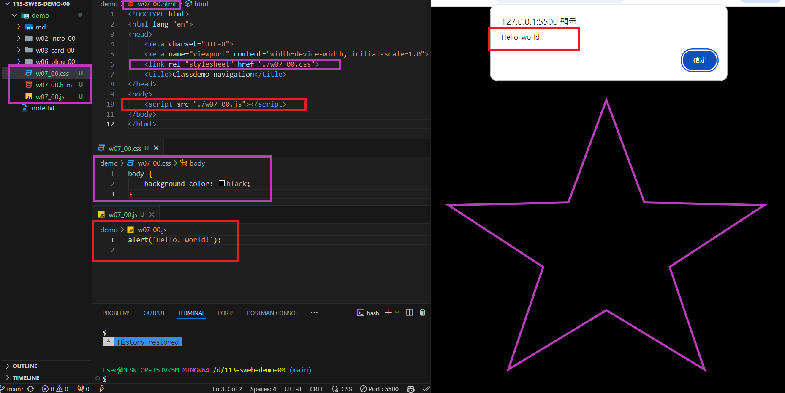
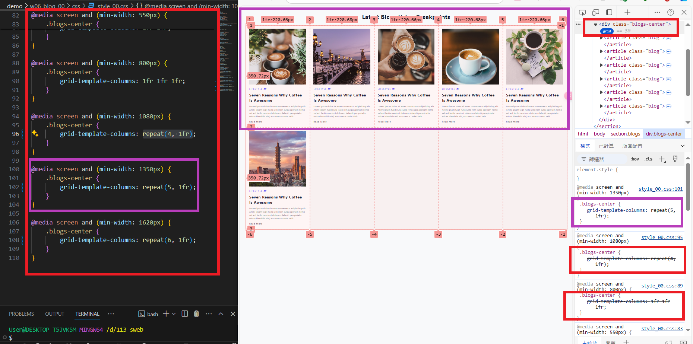
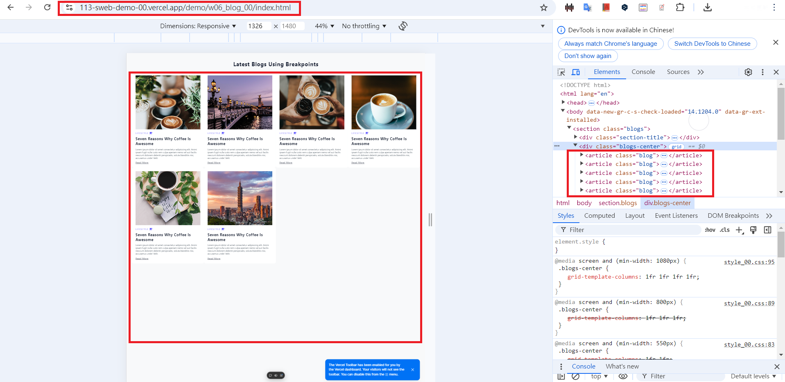
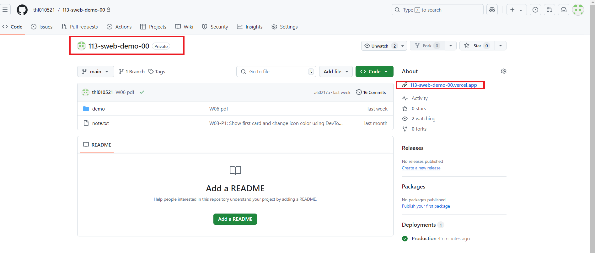
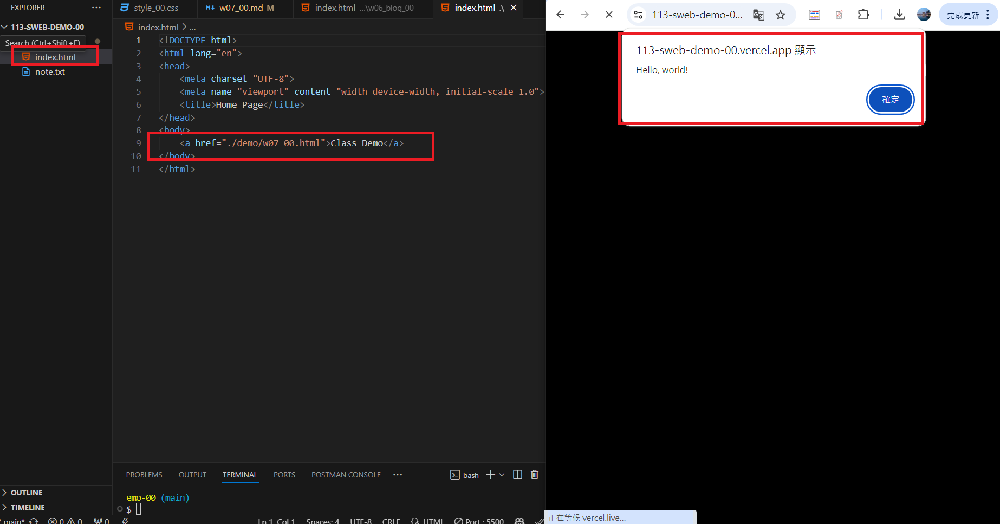
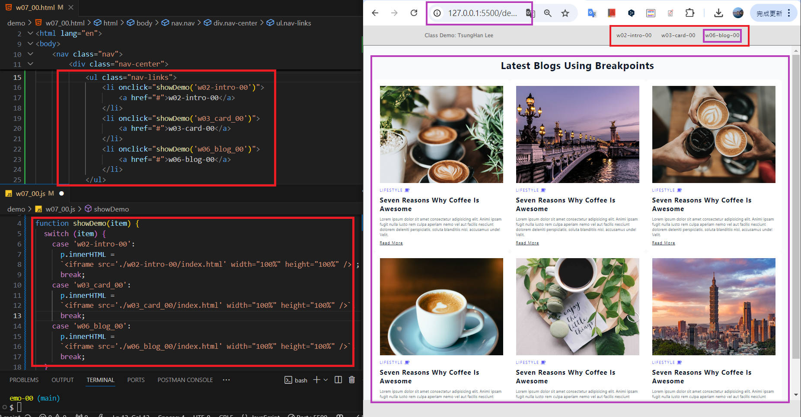
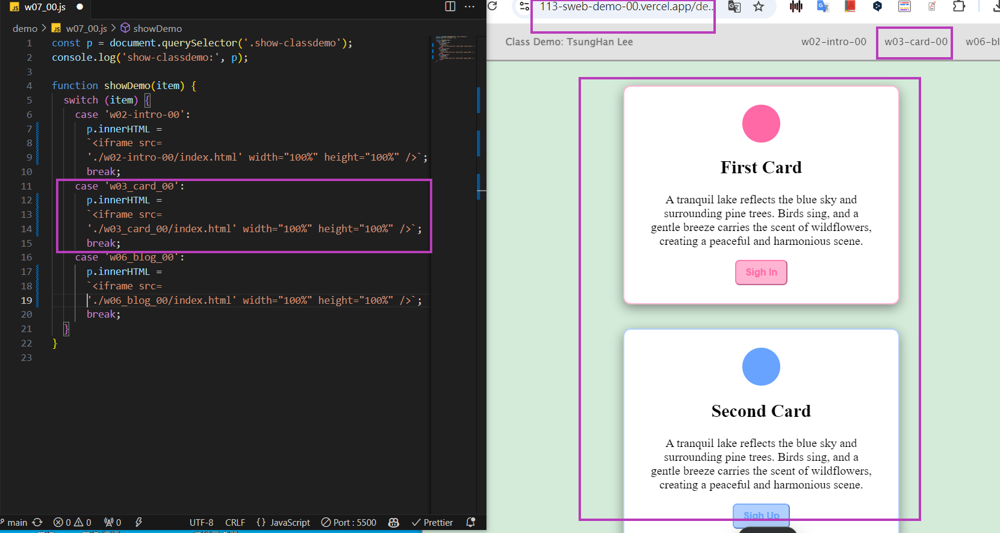

[My Github URL](https://github.com/thl010521/113-sweb-demo-00)

### W07-P1: Test css and js for w07_xx.html



```
ef53b77 thl010521       Sun Oct 27 17:40:01 2024 +0800  W07-P1: Test css and js for w07_xx.html
```

---

### W07-P2: Redo W06-P4 with breakpoints being cancelled



```
0abf8fa thl010521       Sun Oct 27 17:40:41 2024 +0800  W07-P2: Redo W06-P4 with breakpoints being cancelled
```

---

### W07-P3: Connect your Github repo to Vercel and have a root home page to class demo navigation

#### => In Vercel, show w06 blogs demo



#### => Show your Github repo with Vercel URL

[My Vercel URL](https://vercel.com/thl010521s-projects/113-sweb-demo-00)



#### => create index.html as root home page and have a link to class demo navigation as done in w07



```
W07-P3: Connect your Github repo to Vercel and have a root home page to class demo navigation
```

---

### W07-P4: Create navbar with links to class demo w02, w03, w06, and deploy it to Vercel

#### => local



#### => Vercel



```
W07-P4: Create navbar with links to class demo w02, w03, w06, and deploy it to
Vercel
```

---

### W07-logs: git logs of W7

```
$ git log --pretty=format:"%h%x09%an%x09%ad%x09%s" --after="2024-10-17"

91b7888 thl010521       Sun Oct 27 17:44:59 2024 +0800  W07-P4: Create navbar with links to class demo w02, w03, w06, and deploy it to
Vercel
97ec8c9 thl010521       Sun Oct 27 17:44:09 2024 +0800  Continue to the previous p3 content
5df3c89 thl010521       Sun Oct 27 17:41:21 2024 +0800  W07-P3: Connect your Github repo to Vercel and have a root home page to class demo navigation
0abf8fa thl010521       Sun Oct 27 17:40:41 2024 +0800  W07-P2: Redo W06-P4 with breakpoints being cancelled
ef53b77 thl010521       Sun Oct 27 17:40:01 2024 +0800  W07-P1: Test css and js for w07_xx.html
0219dea thl010521       Sun Oct 27 17:24:05 2024 +0800  Upload w07-p4-vercel deployment steps
b37d696 thl010521       Sun Oct 27 15:59:53 2024 +0800  w06/css-optimization & add w07, vercrl home page

```
