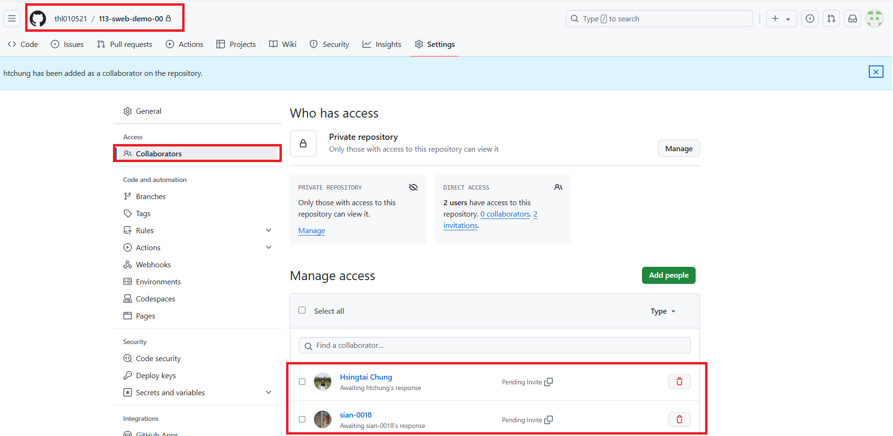
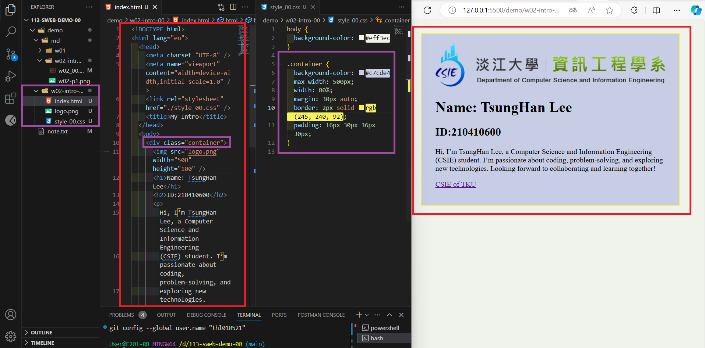

[My Github URL](https://github.com/thl010521/113-sweb-demo-00)

### w02-p1: Collaborate your Github repo to htchung@gms.tku.edu.tw and sian-0018 (TA)



```
88d5913 thl010521       Thu Sep 19 18:59:19 2024 +0800  w02-p1: Collaborate your Github repo to htchung@gms.tku.edu.tw and sian-0018 (TA)
```

---

### W02-P2: My Introduction using html with css selector (container)



```
319ee5d thl010521       Thu Sep 19 21:03:09 2024 +0800  W02-P2: My Introduction using html with css selector (container)
```

---

### W02-P3: git logs of W2

```
319ee5d thl010521       Thu Sep 19 21:03:09 2024 +0800  W02-P2: My Introduction using html with css selector (container)
88d5913 thl010521       Thu Sep 19 18:59:19 2024 +0800  w02-p1: Collaborate your Github repo to htchung@gms.tku.edu.tw and sian-0018 (TA)
```
