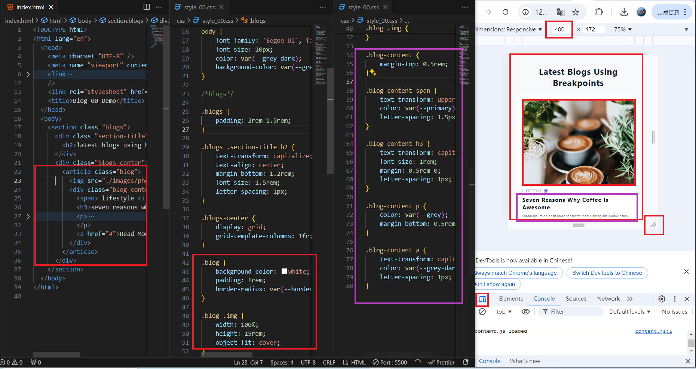
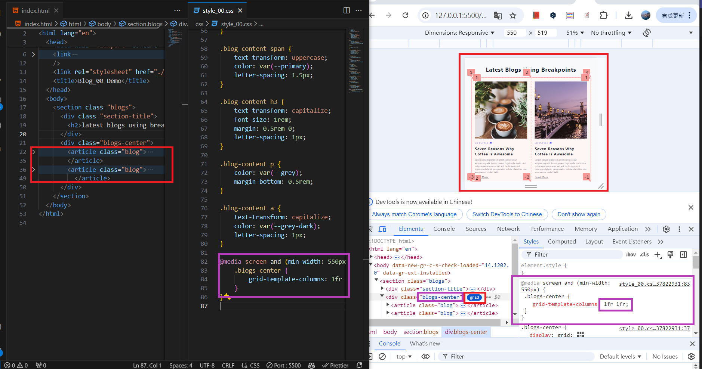
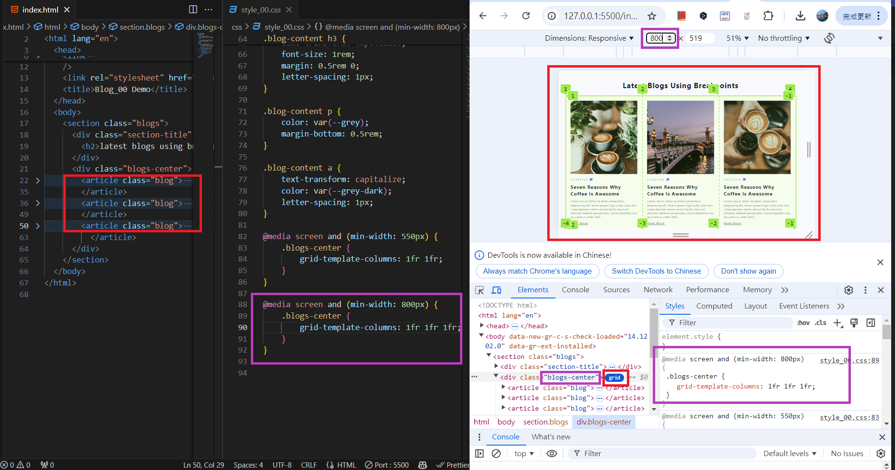
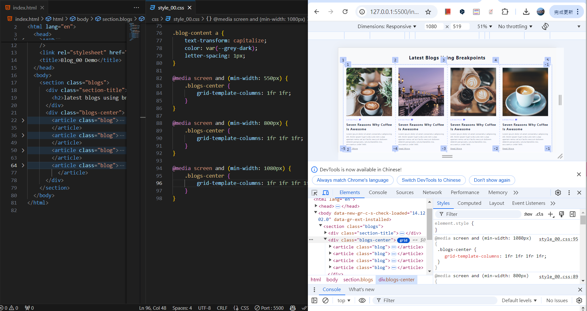
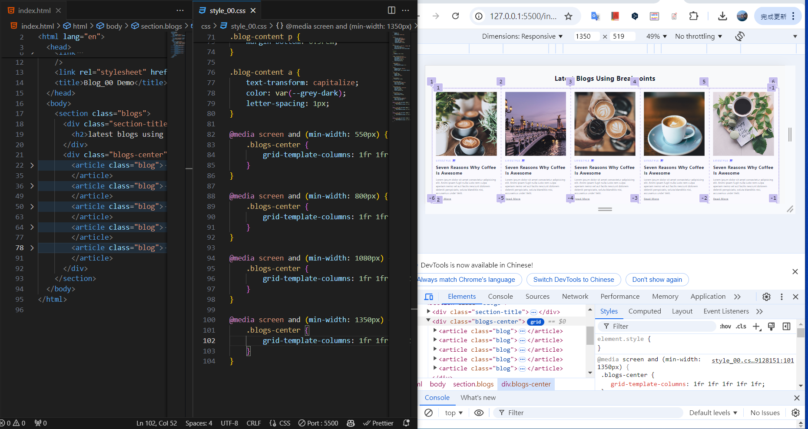
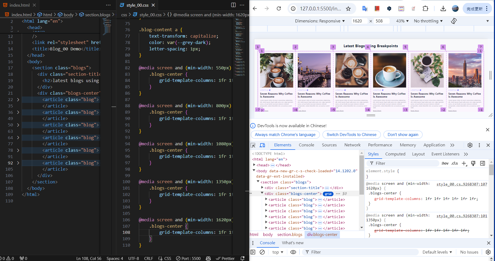
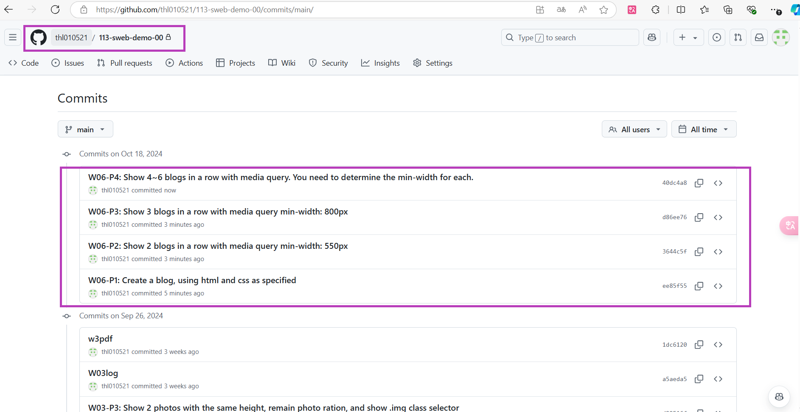

[My Github URL](https://github.com/thl010521/113-sweb-demo-00)

### W06-P1: Create a blog, using html and css as specified



```
ee85f55 thl010521       Fri Oct 18 16:18:40 2024 +0800  W06-P1: Create a blog, using html and css as specified
```

---

### W06-P2: Show 2 blogs in a row with media query min-width: 550px



```
3644c5f thl010521       Fri Oct 18 16:20:11 2024 +0800  W06-P2: Show 2 blogs in a row with media query min-width: 550px
```

---

### W06-P3: Show 3 blogs in a row with media query min-width: 800px



```
d86ee76 thl010521       Fri Oct 18 16:21:07 2024 +0800  W06-P3: Show 3 blogs in a row with media query min-width: 800px
```

---

### W06-P4: Show 4~6 blogs in a row with media query. You need to determine the min-width for each.

#### => 4 blogs in a row



#### => 5 blogs in a row



#### => 6 blogs in a row



```
40dc4a8 thl010521       Fri Oct 18 16:23:15 2024 +0800  W06-P4: Show 4~6 blogs in a row with media query. You need to determine the min-width for each.
```

---

### W06-logs: git logs of W6



```
$ git log --pretty=format:"%h%x09%an%x09%ad%x09%s" --after="2024-10-17"
f0923f2 thl010521       Fri Oct 18 16:28:44 2024 +0800  W06 log & code
40dc4a8 thl010521       Fri Oct 18 16:23:15 2024 +0800  W06-P4: Show 4~6 blogs in a row with media query. You need to determine the min-width for each.
d86ee76 thl010521       Fri Oct 18 16:21:07 2024 +0800  W06-P3: Show 3 blogs in a row with media query min-width: 800px
3644c5f thl010521       Fri Oct 18 16:20:11 2024 +0800  W06-P2: Show 2 blogs in a row with media query min-width: 550px
ee85f55 thl010521       Fri Oct 18 16:18:40 2024 +0800  W06-P1: Create a blog, using html and css as specified
```
